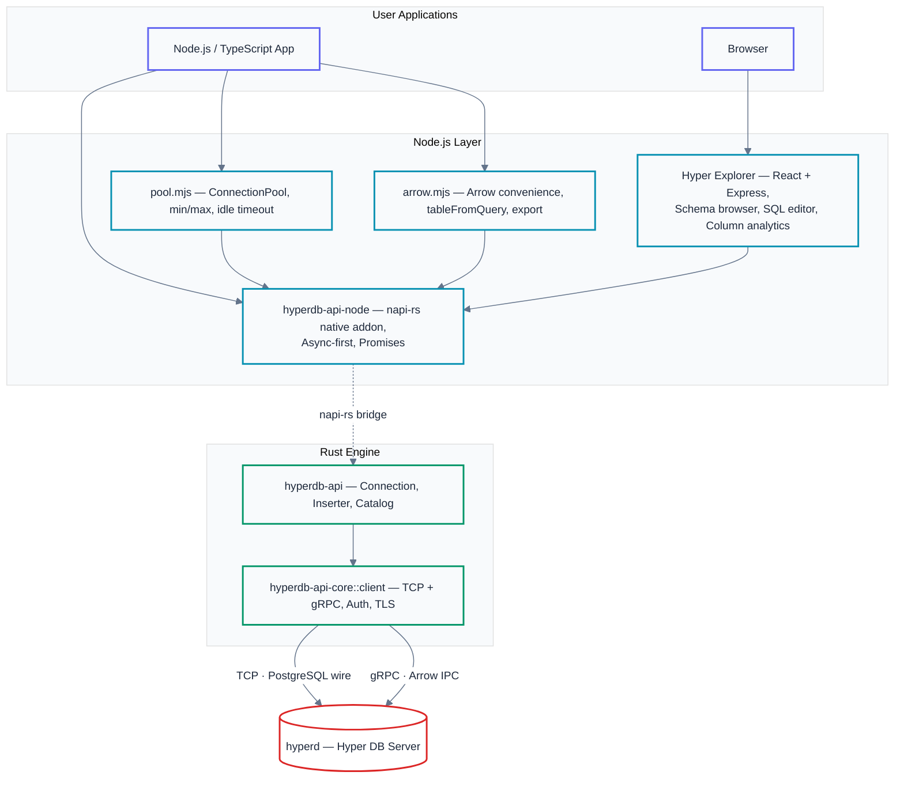

# Hyper Node.js API — Feature Summary

- **Node.js and TypeScript bindings** (`hyperdb-api-node`) for the Hyper database API — wraps the pure-Rust `hyperdb-api` crate as a prebuilt native addon via napi-rs; just `npm install`, no Rust toolchain required
- **Async-first** — all I/O returns Promises; four query APIs spanning convenience to raw throughput (up to 15.5M rows/sec via Arrow IPC)
- **Tagged template literals** — SQL-injection-safe queries with zero boilerplate: `` conn.sql`SELECT * FROM t WHERE id = ${id}` ``
- **Full TypeScript support** — hand-written `.d.ts` declarations with IntelliSense; JavaScript connection pool and Apache Arrow convenience helpers included
- **Hyper Explorer** — a React + Express web application built on `hyperdb-api-node` providing a browser-based database inspector with schema browsing, column analytics, an SQL editor, and a configurable database generator

## Architecture



**Cross-platform** prebuilt binaries: macOS (ARM + x64), Linux (glibc + musl + ARM64), Windows.

---

## Core API

- **`HyperProcess`** — manages local `hyperd` server; properties: `endpoint`, `isOpen`, `logPath`; `connectToDatabase()` convenience method
- **`Connection`** — async database connection; static factories: `connect()`, `connectWithAuth()`, `withoutDatabase()`
- **`ConnectionBuilder`** — fluent builder: `database()`, `createMode()`, `user()`, `password()`, `loginTimeout()`, `build()`
- **`Catalog`** — DDL operations: `createSchema/Table`, `dropSchema/Table`, `getTableNames`, `getSchemaNames`, `hasTable`, `hasSchema`, `createTableIfNotExists`, `dropTableIfExists`
- **`TableDefinition`** — schema definition: `addColumn(name, type, nullable)`, `withSchema()`, `toCreateSql()`, `getColumns()`
- **`SqlType`** — 18 factory methods: `bool`, `smallInt`, `int`, `bigInt`, `float`, `double`, `numeric(p,s)`, `text`, `varchar`, `char`, `bytes`, `date`, `time`, `timestamp`, `timestampTz`, `interval`, `json`, `geography`
- **`Inserter`** — bulk loader via COPY protocol: `addRow()`, `addRows()`, `addColumnar()`, `execute()`
- **`CreateMode`** — `DoNotCreate`, `Create`, `CreateIfNotExists`, `CreateAndReplace`

## Query APIs (by performance tier)

| API | Throughput | Memory | Best For |
|-----|-----------|--------|----------|
| `executeQueryToArrow()` | 15.5M rows/sec | All in memory | Analytics, Arrow ecosystem |
| `executeQueryColumnar()` | 7.9M rows/sec | One chunk | Typed-array numeric processing |
| `executeQuery()` | 1.0M rows/sec | All in memory | Small results, simple access |
| `executeQueryStream()` | 836K rows/sec | One chunk | Large results, row-level logic |

**Result types:**
- **`RowData`** — typed accessors: `getInt32`, `getInt64`, `getBigInt`, `getFloat64`, `getString`, `getBool`, `getBytes`, `getDateMs`, `getTimestampMs`, `getJson`, `isNull`; `toJSON()` with `setColumnNames()` for schema-aware serialization
- **`QueryStream`** — `nextChunk()` + `for await...of` async iteration
- **`ColumnarStream`** / **`ColumnarChunk`** — typed arrays per column: `getInt32Column`, `getFloat64Column`, `getStringColumn`, `getNulls`

## Key Features

- **Tagged template literals** — `` conn.sql`SELECT * FROM t WHERE id = ${id}` `` / `` conn.command`...` `` — SQL-injection-safe, no `$1` boilerplate
- **Parameterized queries** — `executeQueryParams(sql, params)` / `executeCommandParams(sql, params)` with `$1`/`$2` syntax
- **`ConnectionPool`** (from `pool.mjs`) — `min`/`max` connections, idle timeout, acquire timeout; shortcuts: `pool.query()`, `pool.queryParams()`, `pool.use(fn)`; stats: `size`, `idle`, `active`, `pending`
- **Query event hooks** — `conn.on('query', ({sql, durationMs, rowCount, type}) => ...)` for logging/metrics
- **Query statistics** — `conn.enableQueryStats(logPath)` / `conn.lastQueryStats()` for Hyper engine metrics (parse, compile, execute times, memory, storage I/O)
- **Resource management** — `Symbol.asyncDispose` / `Symbol.dispose` for `await using` (Node 22+)
- **Tableau compatible** — `createExtractTable(conn, name, columns)` helper for the Extract schema convention

## Apache Arrow Integration

```bash
npm install apache-arrow   # optional peer dependency
```

| Function (from `arrow.mjs`) | Description |
|-----|-------------|
| `tableFromQuery(conn, sql)` | Query to Arrow `Table` |
| `exportTable(conn, tableName)` | Full table to Arrow `Table` |
| `batchesFromQuery(conn, sql)` | Query to `RecordBatch[]` |
| `queryToArrowFile(conn, sql)` | Query to `.arrow` IPC file bytes |
| `insertFromTable(conn, def, table)` | Arrow `Table` into Hyper |
| `querySchema(conn, sql)` | Query to Arrow `Schema` (no data) |

Raw IPC buffers via `conn.executeQueryToArrow(sql)` and `conn.exportTableToArrow(table)` require no `apache-arrow` dependency.

**Cross-tool interop** — IPC files readable by DuckDB, Polars, pandas, R arrow, Observable.

---

## Hyper Explorer

A full-stack **web application** (React + Express + `hyperdb-api-node`) for inspecting and generating `.hyper` files.

```bash
cd hyperdb-api-node/examples/hyper-explorer
npm install && HYPERD_PATH=/path/to/hyperd npm run dev
# Open http://localhost:5173
```

- **Schema browser** — collapsible tree: schemas, tables, columns (type + nullable metadata)
- **Data preview** — infinite-scroll grid, 200-row pages with read-ahead, server-side sorting via `ORDER BY`
- **Column statistics** — per-column cards: row/null/distinct counts, min/max/mean/median/std dev/percentiles, top values
- **Column detail (numeric)** — 200-bucket histogram, Fourier series overlay with interactive term slider (auto-fit R² >= 99%), FFT spectrum, percentile box plot, coefficient table
- **SQL editor** — full-screen workspace, `Cmd/Ctrl+Enter` to run, auto SELECT vs command detection, schema-aware example chips
- **Database generator** — configurable tables/columns, 8 SQL types, 11 distributions (sequential, uniform, normal, lognormal, exponential, bimodal, categorical/Zipf, uuid, words, bernoulli, uniform_range), persists spec to localStorage
- **Query history** — chronological log with source badges (user / internal), connection ID, formatted SQL modal, wall-clock duration with Hyper engine metrics tooltip on hover
- **File browser** — directory listing with size/modified; remembers last directory
- **Drag-and-drop** — drop `.hyper` files or paths onto the page
- **Connection pool** — per-database pool (max 5 idle) with tracked connections and `_queries` metadata in every response

---

## Performance

Benchmarks on Apple M3 Max, Node.js v24, release build, 1M rows (24 bytes/row).

| Benchmark | Rows/sec | Notes |
|-----------|----------|-------|
| **Arrow query** | 15.5M | `executeQueryToArrow` + `tableFromIPC` |
| **Columnar query** | 7.9M | `executeQueryColumnar`, no Arrow dep |
| **Row query (eager)** | 1.0M | `executeQuery`, all rows in memory |
| **Row query (stream)** | 836K | `executeQueryStream`, chunk iteration |
| **Aggregation** | 195M | Server-side `GROUP BY`, 10 result rows |
| **Insert (COPY)** | 1.4M | `Inserter.addRows()`, 50K-row batches |

---

## Related Documentation

| Document | Description |
|----------|-------------|
| [hyperdb-api-node README](../hyperdb-api-node/README.md) | Full API reference, installation, examples, class diagram, and publishing instructions |
| [Hyper Explorer README](../hyperdb-api-node/examples/hyper-explorer/README.md) | Architecture, API endpoints, and project structure for the web-based database inspector |
| [Benchmark Guide](BENCHMARK_GUIDE.md) | How to run the Rust and Node.js benchmarks, with per-platform results |
| [Full README](../README.md) | Complete project documentation with examples, build instructions, and API reference |
