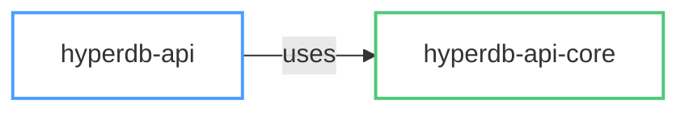

# Rust Documentation Style Guide

This file contains the Rust-specific style guide for developer-targeted documentation.

We distinguish 4 types of documentation:
* **Source code documentation**: Document structs, enums, traits, functions, and modules using rustdoc comments (`///` and `//!`). This is the primary reference for API consumers and renders on [docs.rs](https://docs.rs).
* **Module/crate README**: Document the goals, motivations, architecture, and usage of a crate in its `README.md`. Reference the most relevant types, traits, and functions as entry points into the source code.
* **Process and architecture documentation**: Document general processes (building, testing, releasing, reviewing) and cross-cutting architecture in the top-level `docs/` folder, one Markdown file per topic.
* **Commit messages**: Should contain the *why* a change was made. Short-lived context belongs in the commit description, not in the code.

All crate READMEs and all files in `docs/` should be referenced by `docs/README.md` so that humans and agents alike have a single entry point and know when to read what.
The `docs/README.md` should contain one or two sentences per topic to help determine relevance.


## General Writing Rules

Be concise and to the point.
Don't over-explain — assume that readers are fluent in Rust.

Be precise and avoid vague statements.
Prefer specific names over vague backreferences (e.g., "the `hyperdb-api-core::protocol` module" over "this module" when context is ambiguous).

Write all documentation in American English.
Not everybody on the team is a native English speaker — if you change spelling for consistency, explain why.

When writing documentation, be inclusive of both AI agents and humans.
It is fine to delineate between the two where roles differ, but most guidance should apply to both.


### Cross-Referencing vs. Duplication

If content applies to multiple crates or describes a workflow/process (debugging, profiling, benchmarking, releasing), it belongs in `docs/` as a standalone document.
Crate READMEs should cross-reference it rather than duplicating the content.

Information specific to a single crate stays in that crate's README, even if referenced from `docs/`.

When multiple crates in the workspace share related functionality, consider consolidating into a single document rather than separate per-crate docs that may be hard to discover.
Update all cross-references atomically when moving or consolidating documentation.


## Process and Architecture Documentation

Processes should be documented in the top-level `docs/` folder in a separate Markdown file, one per topic.
Each document should open with a one-liner description, followed by goals, motivations, and specific steps.

Architecture documentation in `docs/` should provide a *high-level* overview of how the crates fit together.
For details, it should reference the crate-specific documentation.


## Crate-Level Documentation (README.md)

Each crate's `README.md` serves two audiences: developers browsing the repository, and users viewing the crate on [crates.io](https://crates.io) (since `Cargo.toml` sets `readme = "README.md"`).

It should start with a one-liner description of what the crate does.

Example:
> The `hyperdb-api-core::protocol` module implements the PostgreSQL wire protocol with Hyper-specific extensions, handling message framing, authentication, and the COPY data path.

It should explain the crate's high-level goals and its relationship to other crates in the workspace.

Example:
> `hyperdb-api-core::protocol` sits between `hyperdb-api-core::types` (type serialization) and `hyperdb-api-core::client` (connection management). It is a low-level module — most users interact with it indirectly through `hyperdb-api`.

It should then provide a **concise overview list** of key functionality, followed by **dedicated sub-sections** that elaborate on each point.
This two-level structure keeps the overview scannable while providing depth.
Keep the overview list in sync with the sub-sections below it.

Example overview:
> The crate provides:
> * `Frontend` / `Backend` — Message types for the client and server sides of the protocol.
> * COPY path — Streaming bulk data via `CopyInWriter` and `CopyOutReader`.
> * Authentication — SCRAM-SHA-256 and MD5 authentication flows.
>
> ### Frontend and Backend Messages
> *(detailed explanation, usage examples...)*
>
> ### COPY Path
> *(detailed explanation...)*

When documenting a crate, **systematically scan all `pub` items**, not just the most prominent ones.
It is easy to miss less obvious but important abstractions (helper types, builder patterns, error types).

Include **code examples** for non-trivial APIs.
A short snippet showing typical usage is often more valuable than a paragraph of prose.
Use realistic code: show actual API calls rather than hardcoded placeholder values.

Document design decisions and trade-offs.
Point out known tech debt and planned improvements.

### Mermaid Diagrams

GitHub renders mermaid diagrams natively. Use them freely in:
* `DEVELOPMENT.md` files (root and per-crate)
* `docs/*.md` design documents
* Internal-module contributor docs (`hyperdb-api-core/docs/DEVELOPMENT-*.md`)

**Exception:** crates.io does **not** render mermaid. For READMEs of published crates (`hyperdb-api`, `hyperdb-api-core`, `hyperdb-api-salesforce`, `hyperdb-mcp`, `hyperdb-bootstrap`, `sea-query-hyperdb`), use ASCII diagrams or omit diagrams entirely.

**Styling:** Do not use filled boxes with background colors — they don't render well across GitHub's light and dark themes. Instead, use colored outlines with `stroke` and keep the fill transparent:



### crates.io Rendering Constraints

Published crate READMEs render on crates.io, which differs from GitHub:
* **No mermaid** — see above.
* **Relative links** — Links to other files in the repo work on GitHub but not on crates.io. Use absolute URLs for cross-crate references when the README is published.
* **Badges** — Place CI/version/docs.rs badges at the top of published crate READMEs.


## Source Code Documentation (Rustdoc)

### Conventions

Use `///` (outer doc comments) for public items — structs, enums, traits, functions, methods, type aliases, and constants:

```rust
/// A connection to a Hyper database server.
///
/// Connections are created via [`HyperProcess`] for local servers
/// or directly via [`Connection::connect`] for remote servers.
pub struct Connection { /* ... */ }
```

Use `//!` (inner doc comments) for module-level and crate-level documentation, placed at the top of `lib.rs` or `mod.rs`:

```rust
//! # hyperdb-api-core — types module
//!
//! Type definitions and binary serialization for the Hyper database.
//!
//! This crate provides the [`SqlType`] system, [`ToHyperBinary`] and
//! [`FromHyperBinary`] traits for converting between Rust types and
//! Hyper's binary wire format.
```

### What to Document

Every public item should have at least a one-liner description.
The `#![warn(missing_docs)]` lint enforces this — it is enabled across all crates in this workspace.

In general, types, traits, and functions should have descriptive names such that intended semantics are clear from the call site alone.
The doc comment should still provide a one-liner, plus document any non-obvious, surprising, or important behavior.

When referencing types in documentation, prefer type/trait names over file names (e.g., "`Connection`" rather than "`connection.rs`").
Type names are sufficient for readers to locate definitions and are more stable than file paths.
Use rustdoc's intra-doc links: `[`Connection`]` or `[`crate::Connection`]`.

### Standard Sections

Use these conventional heading sections in doc comments where applicable:

```rust
/// Opens a connection to the database.
///
/// # Examples
///
/// ```no_run
/// use hyperdb_api::{Connection, HyperProcess};
///
/// let hyper = HyperProcess::new(None, None)?;
/// let conn = Connection::open(&hyper, "example.hyper")?;
/// # Ok::<(), hyperdb_api::Error>(())
/// ```
///
/// # Errors
///
/// Returns [`Error::ConnectionFailed`] if the server is unreachable.
///
/// # Panics
///
/// Panics if `path` contains a null byte.
pub fn open(process: &HyperProcess, path: &str) -> Result<Self, Error> {
```

* **`# Examples`** — Provide for all non-trivial public APIs. Doc examples are compiled and run by `cargo test`, so they also serve as integration tests. Use `no_run` for examples that need a running `hyperd` server. Use `# ` prefix to hide boilerplate lines.
* **`# Errors`** — Document all error variants that can be returned.
* **`# Panics`** — Document conditions that cause a panic.
* **`# Safety`** — Required on all `unsafe fn` declarations. Document the invariants the caller must uphold.

### Safety-Critical Documentation

Safety-critical information — lifetime requirements, `unsafe` invariants, security implications, known limitations — **must** be documented in source code comments, not only in the crate README.
Developers reading a type or function signature should not need to consult external docs to learn that misuse leads to unsoundness or data loss.

### Code Organization in Function Bodies

Inside function bodies, delineate sections of code into distinct paragraphs separated by empty lines.
Paragraphs may have a leading comment explaining their high-level purpose:

```rust
// Parse the authentication challenge from the server
let challenge = read_auth_message(&mut stream)?;

// Compute the SCRAM-SHA-256 response
let response = scram_response(&challenge, password);

// Send the response and wait for confirmation
stream.write_message(&response)?;
let result = read_auth_result(&mut stream)?;
```

### Doc Tests

Doc examples in `///` comments are compiled and executed by `cargo test`. This is one of Rust's most powerful documentation features — use it.

Guidelines:
* Wrap examples in ```` ```rust ```` (or ```` ```no_run ```` / ```` ```ignore ```` when appropriate).
* Use `# ` to hide setup lines that distract from the point of the example.
* Use `?` with a hidden `Ok::<(), Error>(())` return for ergonomic error handling.
* Ensure examples compile against the crate's public API, not internal details.
* If an example requires external state (a running server, files on disk), use `no_run`.


## Workspace-Level Documentation

### docs/ Directory

The `docs/` folder contains cross-cutting design documents, process guides, and reference material.
Each file should cover a single topic.
Keep the scope of each document focused — prefer multiple smaller documents over one large one.

### docs/README.md

`docs/README.md` is the index into all documentation.
It should list every document with a one or two sentence description explaining what it covers and when to read it.
This enables both humans and agents to quickly find relevant documentation.

### DEVELOPMENT.md

Each crate should have a `DEVELOPMENT.md` for contributor-facing content that does not belong in the user-facing README:
* Internal architecture and design decisions
* Implementation details (wire formats, algorithms, encoding schemes)
* Build and test instructions specific to that crate
* Known tech debt and planned improvements
* How to extend the crate (adding types, transports, etc.)

The root `DEVELOPMENT.md` covers workspace-wide topics: overall architecture, building, testing, CI, and release process.

### CONTRIBUTING.md

A single `CONTRIBUTING.md` at the workspace root covers governance, code style expectations, PR process, commit conventions, and release workflow.
Do not duplicate this per crate.

### Cargo.toml Metadata

Published crates should have complete metadata in `Cargo.toml`:
* `description` — One-line summary (renders on crates.io search results)
* `readme = "README.md"` — Points to the crate's README
* `repository`, `homepage` — Link to the GitHub repo
* `license` — SPDX expression
* `keywords` — Up to 5 keywords for crates.io search
* `categories` — crates.io categories
* `rust-version` — MSRV (Minimum Supported Rust Version)


## Documentation Review Checklist

When reviewing documentation changes, verify:

- [ ] Public items have `///` doc comments with at least a one-liner
- [ ] `unsafe` functions have a `# Safety` section
- [ ] Fallible functions document their error conditions
- [ ] Code examples compile (run `cargo test --doc`)
- [ ] Intra-doc links resolve (run `RUSTDOCFLAGS="-D warnings" cargo doc`)
- [ ] Crate README does not contain implementation internals — those belong in DEVELOPMENT.md or source comments
- [ ] Cross-references use links rather than duplicating content
- [ ] New docs/ files are listed in docs/README.md
- [ ] No stale references to renamed or removed items
