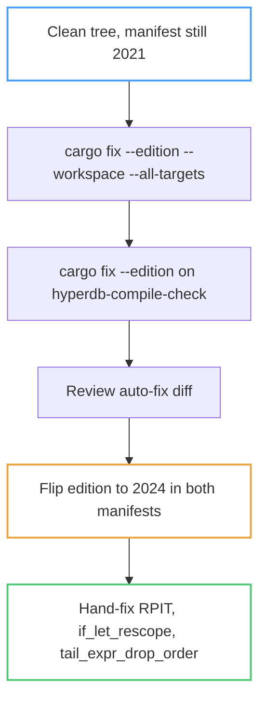

# Rust 1.88 / Edition 2024 Uplift — Design Specification

Raise the workspace MSRV floor to Rust 1.88, migrate to edition 2024, adopt the
language features that unlock, and add a RHEL 9.7 `rust-toolset` compatibility
gate so enterprise consumers can build without `rustup`.

**Status:** approved and adversarially reviewed; not yet implemented
**Date:** 2026-09-04

> **Review note (2026-09-04).** An adversarial plan review verified the three
> load-bearing semantic claims against a real toolchain rather than by
> argument, and all three hold: D5's scoping (plain `cargo check --workspace
> --locked` passes on a toolchain below `sysinfo`'s 1.95 floor while
> `--all-targets` fails), D3's edition-of-expansion reasoning (a proc macro
> compiled at edition 2021 emits bare `#[no_mangle]` into an edition-2024
> consumer without error, while the same attribute hand-written there is a
> hard error), and D8's resolver claim (a virtual manifest emits
> `warning: virtual workspace defaulting to "resolver = "1""` despite an
> edition-2024 member). One D8 refinement: `hyperdb-compile-check` needs **no**
> resolver edit — it is a *package* workspace root and infers v3 from its own
> edition. The review also found ten plan defects, all corrected in the
> implementation plan; the largest was a drop-order inventory built by
> grepping for a syntactic shape instead of asking the compiler, which
> undercounted by roughly 3x.
**Branch:** `feat/upgrade-to-188-RHEL97` (base `28c8813`, equal to `origin/main`)
**Implementation plan:** [`docs/superpowers/plans/1_88_uplift/`](../plans/1_88_uplift/README.md)

---

## Problem

Three separate problems share one root cause, which is why they are solved
together.

**The declared MSRV is fiction.** `Cargo.toml` claims `rust-version = "1.81"`
and `clippy.toml` claims `msrv = "1.81"`, but the lockfile has drifted well past
that: `napi` and `napi-derive` declare 1.88, `tonic`, `sea-query`, `zip`, and
`jsonwebtoken` declare 1.88, `arrow`, `clap`, and `prost` declare 1.85, and
`sysinfo 0.39.6` declares 1.95. Roughly 99 resolved packages advertise 1.85 or
newer. This is a live violation of **M-OOBE** as
[`docs/RUST_GUIDELINES.md`](../../RUST_GUIDELINES.md) defines it ("fails if a
direct or transitive dep requires a newer toolchain"), and it went unnoticed
because the "MSRV check" that guideline names as its enforcement does not exist.
Every CI job pins floating `stable`.

**Edition 2021 blocks features the code visibly wants.** The protocol and gRPC
layers contain depth-4 `if let` pyramids that let chains flatten to a single
condition. The connection pool forces `Box::pin(async move { ... })` on every
user-supplied hook, and its own rustdoc teaches that pattern. Eight
return-position `impl Trait` signatures rely on implicit lifetime capture.

**Enterprise consumers cannot build without `rustup`.** RHEL 9.7 ships Rust
Toolset 1.88.0 in AppStream, which is exactly the floor this crate needs, but
nothing verifies that path. Two developer-convenience files actively break it:
`rust-toolchain.toml` and the clang/mold linker override in
`.cargo/config.toml`.

---

## Ground truth

Measured on 2026-09-04, not assumed. These numbers drive the decisions below.

- **Local toolchain is rustc 1.98.0**, resolved from `channel = "stable"` in
  `rust-toolchain.toml`. The repo's "1.81" is a declared floor, never a pin.
- **RHEL 9.7 ships Rust Toolset 1.88.0.** Red Hat's 9.7 release notes call out
  stable Rust 2024 Edition, let chains, and `async` closures by name.
- **The workspace is unusually well prepared for edition 2024.** Zero
  `static mut`, zero hand-written `extern` blocks, zero hand-written
  `#[no_mangle]` / `#[export_name]` / `#[link_section]`, zero `gen`
  identifiers, and zero `$x:expr`-followed-by-`const` macro patterns. Both
  `unsafe fn` in the tree already wrap their operations in inner `unsafe {}`
  blocks, because `Cargo.toml` has set `unsafe_op_in_unsafe_fn = "deny"` since
  before this work began.
- **Strict provenance has nothing to migrate.** Zero integer-to-pointer casts,
  zero `usize as *const/*mut`, zero `mem::transmute` on pointers or integers.
  The 19 `unsafe {}` blocks are all OS/FFI (`libc`, env vars, napi casts).
- **The residual edition risk is concentrated**, not diffuse: eight RPIT
  signatures, roughly 27 `if let`-over-mutex-guard sites, 104 `ref`/`ref mut`
  patterns, and one upstream proc-macro question in `hyperdb-api-node`.

---

## Decisions

### D1 — Keep `channel = "stable"`; raise only the MSRV floor

Setting `channel = "1.88.0"` would *downgrade* local development from 1.98.0 by
ten releases, and would break `cargo test` outright via `sysinfo`'s 1.95
requirement. The MSRV floor and the development toolchain are separate
concerns: the floor is a compatibility contract enforced by CI, not something
developers should be pinned to.

- **Chosen:** `channel = "stable"`, `rust-version = "1.88"`, `msrv = "1.88"`.
- **Rejected — hard-pin `1.88.0`:** costs ten releases of compiler and lint
  improvements, and forces a `sysinfo` downgrade for every developer.
- **Rejected — delete `rust-toolchain.toml`:** loses `rustfmt`/`clippy`
  component provisioning for new contributors, which is the file's real value.

Consequence: RHEL compatibility must be proven by a dedicated CI job, since no
developer's local toolchain exercises 1.88. That is D4.

### D2 — Migrate the edition with `cargo fix` before editing the manifest

`cargo fix --edition` reads the *current* edition from the manifest and applies
the migration lints for the next one. Bumping the manifest first makes the
command a no-op.

`--all-targets` is mandatory or tests, benches, and examples are silently
skipped. `hyperdb-compile-check` is excluded from the workspace (its own
`[workspace]` breaks a Cargo dependency cycle) and needs a separate run against
its own manifest path.

### D3 — Treat `hyperdb-api-node` as a gate, not a follow-up

The Node bindings are the only crate whose edition-2024 viability depends on
code this repository does not own. The crate's own source is clean, but
`ctor 1.0.5` — a transitive dependency of both `napi` and `napi-derive` — is a
proc macro that emits bare `#[no_mangle]` into the *consuming* crate at
`parse.rs:1024` and `:1050`.

It should be fine: rustc resolves edition-dependent parsing by the edition of
the crate that *defines* a macro, and `ctor 1.0.5` is `edition = "2021"`.
napi-rs's own documentation states the v3 workspace declares Rust 1.88 as its
minimum, so this stack is contemporaneous with edition 2024.

That is reasoning, not evidence. Per AGENTS.md reminder 10 it must be proven
with real build output before any other work starts, because a red result
changes the shape of the entire migration. Hence Phase 0.

- **Chosen:** a throwaway spike that overrides `edition = "2024"` in
  `hyperdb-api-node/Cargo.toml` alone and builds that one crate.
- **Fallback if red:** keep `hyperdb-api-node` on a literal
  `edition = "2021"` while the rest of the workspace moves. Editions are
  per-crate, so this is viable and costs only a documented comment.

### D4 — Prove RHEL compatibility in a UBI9 container, not with a version pin

A `cargo +1.88 check` job would test the version but not the *environment*. The
interesting failure modes are environmental: no `rustup`, no `mold`, no
`clang`, no `protoc`.

- **Chosen:** a container job on `registry.access.redhat.com/ubi9/ubi:latest`
  that installs only `rust-toolset` plus genuine build prerequisites, strips
  both developer-convenience override files, and runs `cargo check`.
- **Rejected — `cargo +1.88 check` on `ubuntu-latest`:** cheaper, but proves
  nothing about the RHEL package set or the absence of `rustup`.

Two design details are load-bearing:

- **The job must strip `.cargo/config.toml`, not just `rust-toolchain.toml`.**
  The mold override applies to `x86_64-unknown-linux-gnu`, and `cargo check`
  still links build scripts and proc-macro crates for the host, so UBI9 fails
  without it. `rust-toolchain.toml` removal is defensive by comparison: a
  distro-packaged `cargo` is not a `rustup` shim and ignores that file anyway.
- **The job must use plain `cargo check`, not `--all-targets`.** `--all-targets`
  pulls `sysinfo` and its 1.95 floor. This is a genuine scope limit, documented
  rather than hidden.

### D5 — Scope the RHEL gate to lib and bin targets for now

`sysinfo 0.39.6` requires rustc 1.95 and is a *dev*-dependency of `hyperdb-api`
used only by `hyperdb-api/benches/common.rs`.

- **Chosen (initial):** document the limit and gate lib/bin targets only. A
  benchmark-only dependency should not dictate the crate's public MSRV.
- **Preferred (follow-up):** downgrade `sysinfo` to a release at or below 1.88
  and promote the gate to `--all-targets`, which makes the 1.88 claim complete.

### D6 — Per-crate changelogs are hand-maintained; the root changelog is not

[`AGENTS.md`](../../../AGENTS.md) reminder 8 and
[`CONTRIBUTING.md`](../../../CONTRIBUTING.md) appear to contradict each other on
changelogs. They govern different files:

- The **root** `CHANGELOG.md` has no `## [Unreleased]` section, uses
  release-please's generated format, and is the only `changelog-path` in
  `release-please-config.json`. Never hand-edited.
- The **seven per-crate** `CHANGELOG.md` files each carry exactly one
  `## [Unreleased]` section and appear in neither `packages` nor `extra-files`
  of the release-please config. Hand-maintained.
- The npm sub-package changelogs under `hyperdb-api-node/npm/*/` and
  `hyperdb-mcp/npm/*/` have no `## [Unreleased]` section. Left alone.

This matches the constraint already recorded in
[`2026-08-13-hyperdb-mcp-agent-ux.md`](../plans/2026-08-13-hyperdb-mcp-agent-ux.md):
"Append user-visible entries only to `hyperdb-mcp/CHANGELOG.md` under
`## [Unreleased]`; do not edit versions or the root generated changelog."

`AGENTS.md` reminder 8 cites `CONTRIBUTING.md#authoring-changes-every-contributor`,
an anchor that does not exist. Corrected as part of this work.

### D7 — Mark the MSRV bump breaking, departing from M-MSRV

Upstream **M-MSRV** says bumping an MSRV "does not require a major release, but
can be handled through a minor update," because "forcing a major version bump
will not confer any benefits, but could possibly bifurcate downstream
dependencies."

We depart from that here, deliberately.

- **Chosen:** `feat(toolchain)!:` for the Phase 1 MSRV and edition commit.
  Note the `!` position: it must sit immediately before the colon.
  `feat!(toolchain):` does not match the Conventional Commits header regex
  release-please uses, so it would silently produce no changelog entry.
- **Rationale:** M-MSRV's motivation is avoiding needless ecosystem
  bifurcation. The API currently has few users, and D9 commits to an
  intentional 1.0.0 stabilization, so there is no downstream population to
  bifurcate. Upstream's Golden Rule is explicit that "it is the spirit that
  counts, not the letter," and that a guideline should not be followed where
  doing so would violate its own motivation.
- **Secondary point:** under D9 the commit type does not set the version at
  all. A `Release-As:` footer overrides release-please's computed bump, so `!`
  is purely a changelog annotation — and an MSRV plus edition raise earns one.

Phase 2.3 independently uses `feat!:`, because `use<..>` bounds change public
signatures.

### D8 — Move the workspace to resolver v3

Edition 2024 implies Cargo resolver v3, but the root manifest is *virtual* (a
`[workspace]` with no `[package]`), and Cargo does not infer a resolver from
the edition for virtual workspaces. `Cargo.toml:2` currently pins
`resolver = "2"`, which would silently hold the workspace on the old resolver
after the edition flip.

- **Chosen:** set `resolver = "3"` explicitly.
- **Rejected — delete the field**, which is what upstream **M-LATEST-EDITION**
  suggests ("the `resolver` field is generally not needed"). That advice
  targets normal crates; for a virtual manifest, removing it falls back to v1.

Resolver v3 is MSRV-aware, so it makes future `cargo update` runs prefer
dependency versions compatible with `rust-version = "1.88"`. That partially
mitigates blocker B1 going forward, though it does not retroactively fix the
existing lockfile.

### D9 — Release the migration as 1.0.0, gated behind release candidates

The migration is the natural moment to stabilize: it raises the MSRV, changes
the edition, and alters public signatures, all while the user base is small
enough that a break is cheap.

- **Chosen:** Phases 0 through 3 land unreleased; Phase 4 then cuts a single
  `1.0.0-rc.1` covering the whole migration, gates promotion on a public-API
  audit, and releases `1.0.0`. Further RCs only if the audit or user feedback
  demands them.
- **Rejected — one RC per phase:** three release cycles for a change set that
  is only coherent as a whole. Phase 1 alone (MSRV raised, modernization not
  yet done) is not a state worth asking users to test.
- **Rejected — ship as `0.8.0` and stabilize later:** defers the decision
  without reducing the work, and spends the cheap-break window on a version
  nobody treats as stable.

No new release machinery is required. `docs/GITHUB_OPERATIONS.md` already
documents the `Release-As:` footer; the `x-release-please` markers already
cover the exact-match pin in `hyperdb-api/Cargo.toml`; and
`npm-build-publish.yml` already validates `-rc.N` shapes and routes them to
the `rc` dist-tag rather than `latest`. crates.io needs nothing — `cargo add`
skips prereleases unless a user opts in explicitly.

**Permanent consequence, accepted:** `bump-minor-pre-major: true` only affects
`0.x`. From 1.0.0 onward a `feat!:` commit means **2.0.0**, ending the era of
cheap breaking changes. That is the point of stabilizing, but it makes the
Phase 4 API audit the last inexpensive opportunity to change public paths and
signatures.

---

## Blockers

- **B1 — `sysinfo 0.39.6` requires rustc 1.95.** Resolved by D5.
- **B2 — raising `clippy.toml` MSRV unsuppresses MSRV-gated lints.** The
  `clippy` CI job runs `-- -D warnings` and `[workspace.lints.clippy]` sets
  `pedantic = "warn"`, so `is_none_or`, `manual_midpoint`, `manual_let_else`,
  and the let-chain family all fire at once. The bump and the lint burn-down
  must land together, not as separate commits.
- **B3 — `.cargo/config.toml` forces clang + mold on Linux.** Resolved by D4.
- **B4 — `rust-toolset` alone cannot build this repo.** `hyperdb-api-core`
  generates gRPC bindings via `tonic_prost_build`, so `protoc` is required;
  the existing `clippy` job also installs `libfontconfig1-dev`. Package
  availability in the UBI repository subset is verified by probe before the
  workflow is written, per AGENTS.md reminder 9.
  This blocker is a *symptom* of a standing **M-OOBE** deviation, not a
  container quirk: upstream requires published crates to build with nothing
  beyond `cargo` and `rustc`, and names `.proto` compilation specifically as a
  case where generation belongs in the publishing workflow with the resulting
  `.rs` vendored into the crate. Recorded under "Guideline-level deviations"
  in [`docs/RUST_GUIDELINES.md`](../../RUST_GUIDELINES.md) and deliberately
  out of scope here — fixing it properly would remove the `protoc` install
  from both the RHEL job and every downstream consumer's build.
- **B5 — Apple Silicon yields a false pass.** The mold override is scoped to
  `x86_64-unknown-linux-gnu`, so an arm64 UBI9 container never triggers B3.
  The local `make check-rhel` target must pass `--platform linux/amd64`.
- **B6 — `hyperdb-compile-check` is a separate workspace** with its own
  `edition` and `rust-version`. Needs its own `cargo fix` run and manifest
  edit, and may need `HYPERD_PATH` set, since it builds a real Hyper database
  at compile time.

---

## Non-goals

- **No `number::midpoint` adoption.** The only candidates are cosmetic `f64`
  chart half-widths in `hyperdb-mcp/src/chart.rs`. No integer binary-search
  midpoint exists, so the overflow-safety argument does not apply.
- **No strict-provenance work.** Nothing to migrate; see Ground truth.
- **No byte-swap modernization.** The protocol layer already uses
  `from_le_bytes` / `to_le_bytes` throughout. The available win is
  `split_at_checked` for bounds checks, which is a different change.
- **No crate version edits.** release-please owns versions; `bump-minor-pre-major`
  is set, so a breaking change at `0.x` yields `0.8.0`.
- **No Node engine alignment.** The `node-bindings` job uses Node 20 while
  `package.json` declares `>= 21`. Pre-existing and unrelated; flagged, not
  fixed.
- **No feature flags for `hyperdb-api`.** Deferred to post-1.0.0 by explicit
  decision — see the following section, which records one constraint that must
  be settled *before* 1.0.0 ships.

## Deferred: feature flags for `hyperdb-api` (post-1.0.0)

Intent: let API users disable capabilities they do not need, rather than
`hyperdb-api` shipping TLS, pooling, geography, transactions, and chrono
unconditionally. Out of scope for this migration, recorded here so the
constraints are not rediscovered.

**Upstream M-FEATURES-ADDITIVE sets the rules.** All library features must be
additive and *any* combination must work. Specifically: adding a feature must
not disable or modify any public item; features must not depend on other
features being manually enabled; and a `std` feature is correct where a
`no-std` feature would be wrong.

**One decision cannot wait for post-1.0.0.** The semver cost is asymmetric:

- Taking currently-always-on capability and putting it behind a
  **default-on** feature is **non-breaking**. Existing users get the defaults
  and notice nothing; users wanting a slim build opt out via
  `default-features = false`. This is a minor bump and can be done any time
  after 1.0.0.
- Putting it behind a **default-off** feature is **breaking** — existing users
  silently lose the capability until they opt in. After 1.0.0 that costs a
  major version.

So if any capability should eventually be genuinely opt-in rather than
opt-out, that has to land before 1.0.0. Everything else can wait. Task 4.2's
API audit is the right place to make that call, since it is already the last
inexpensive moment to change the public surface.

**A second payoff worth noting.** Upstream **M-DONT-LEAK-TYPES** permits
leaking third-party types "behind a relevant feature flag," and
`hyperdb-api` currently leaks `arrow::RecordBatch`, `bytes::Bytes`, `chrono`,
and `geo-types` unconditionally. Feature-gating those leaks is the
guideline-endorsed shape, so this work is a compliance improvement and not
only a build-size one.

**Consequence for CI.** `docs/RUST_GUIDELINES.md` currently records
`cargo-hack` as "not applicable — no feature flags by design." The moment
flags land, M-FEATURES-ADDITIVE's "any combination must work" requirement
makes `cargo-hack` the tool that verifies it, and that note must be revisited.

---

## Open questions

- Does the UBI9 repository subset carry `protobuf-compiler`? If not, the
  fallback ladder is `ubi-9-codeready-builder`, then a pinned `protoc` release
  tarball via `PROTOC`. Resolved by the Phase 3.0 probe.
- Is `dyn AsyncFn` object-safe enough to replace the pool's
  `Arc<dyn Fn(...) -> HookFuture>` storage, or does the win land only at call
  sites? Determined during Phase 2.2; the call-site win alone justifies the
  change.
