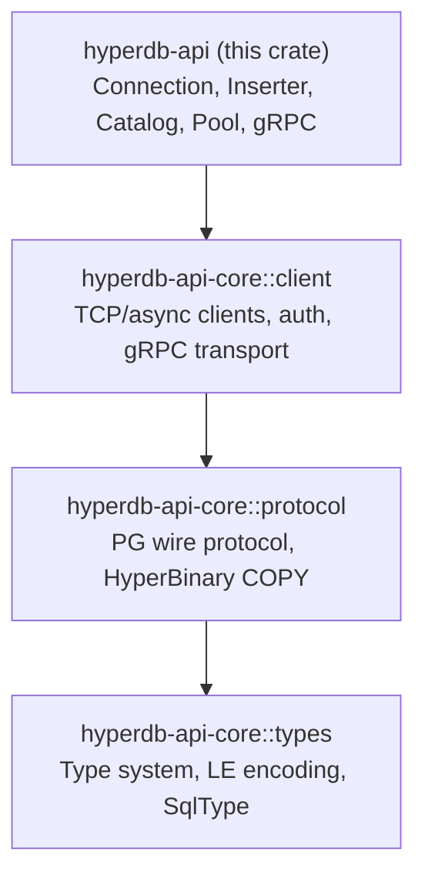

# hyperdb-api — Development Guide

Internal architecture, implementation details, and contributor guidance for the
`hyperdb-api` crate. For user-facing documentation, see [README.md](README.md).

## Architecture

`hyperdb-api` is the top of a two-crate stack (with 3 internal submodules in `hyperdb-api-core`). It re-exports types from the lower
layers so users only need `hyperdb-api` in their `Cargo.toml`.



Each layer has clear responsibilities:

| Crate | Owns | Should NOT contain |
|---|---|---|
| `hyperdb-api-core::types` | Binary encoding, type definitions | Network I/O, protocol logic |
| `hyperdb-api-core::protocol` | Wire message encode/decode, COPY format | Connection management, retries |
| `hyperdb-api-core::client` | TCP/gRPC clients, auth, TLS | High-level API sugar, schema introspection |
| `hyperdb-api` | User-facing API, `Inserter`, `Catalog`, pool | Wire-level details, raw protocol bytes |

### Key Modules

| Module | Role |
|---|---|
| `connection.rs` | Unified `Connection` (TCP + gRPC) |
| `async_connection.rs` | Tokio-based `AsyncConnection` |
| `transport.rs` | Internal `Transport` enum, endpoint auto-detection |
| `result.rs` | `Rowset`, `Row`, `RowIterator`, streaming |
| `inserter.rs` | `Inserter`, `InsertChunk`, `ChunkSender` |
| `grpc_connection.rs` | `GrpcConnection` / `GrpcConnectionAsync` |
| `process.rs` | `HyperProcess` — spawns/manages `hyperd` |
| `proofs.rs` | Kani formal verification harnesses |

## Thread Safety Model

`Connection` is `Send` but **not** `Sync`. This means:

- A connection can be moved to another thread (`Send`).
- A connection cannot be shared across threads via `&Connection` (`!Sync`).
- The underlying `hyperdb_api_core::client::Client` holds a mutable TCP stream that is not
  safe for concurrent reads/writes.

**Query cancellation is the exception.** `Connection::cancel()` is thread-safe
because it opens a *separate* TCP connection to send a PG `CancelRequest`
message — it never touches the main stream. Wrap the connection in `Arc` and
call `cancel()` from any thread.

`HyperProcess` is `Send` but not `Sync` — same reasoning (owns a
`TcpStream` callback connection).

For concurrent access, use one of:

1. **One connection per thread** — simplest model for sync code.
2. **`AsyncConnection` + connection pool** — the `pool` module provides a
   `deadpool`-based pool for high-concurrency async workloads.
3. **`ChunkSender` for parallel inserts** — multiple threads encode
   `InsertChunk`s in parallel; a single `ChunkSender` serializes the sends
   via an internal `Mutex`.

## Transport Abstraction

`Connection` wraps an internal `Transport` enum:

```rust
// hyperdb-api/src/transport.rs (internal)
pub(crate) enum Transport {
    Tcp(Box<TcpTransport>),
    Grpc(Box<GrpcTransport>),
}
```

Transport is auto-detected from the endpoint string in `detect_transport_type()`:

| Prefix | Transport |
|---|---|
| `http://`, `https://` | gRPC |
| `tab.domain://`, absolute path | Unix Domain Socket (Unix) |
| `tab.pipe://`, `\\` prefix | Named Pipe (Windows) |
| Everything else | TCP |

gRPC connections are **read-only** — `execute_command()` returns an error.
`supports_writes()` exposes this check. TCP/UDS/Named Pipe all go through the
PG wire protocol and support full read-write.

### Unified Connection vs Direct gRPC

Two ways to use gRPC: (1) `Connection::connect("http://...")` auto-detects
gRPC and returns `Rowset` with the same API as TCP; (2) `grpc::GrpcConnection`
gives explicit control over `TransferMode` and raw Arrow IPC bytes.

The unified path creates a new `GrpcClientSync` per Arrow query (see
`Transport::execute_query_to_arrow`) — acceptable for batch-style operations.

## Lifetime Design

The crate uses a simple hierarchical borrow pattern. All dependent types carry
a single `'conn` lifetime tying them to the `Connection` they borrow:

```text
Connection (owns underlying client)
 |-- Inserter<'conn>
 |-- Catalog<'conn>
 |-- Rowset<'conn>
 |-- Transaction<'conn>
```

There are no circular references and no multi-lifetime bounds. The borrow
checker enforces that a `Connection` cannot be dropped while any dependent
type holds a reference.

See the "Lifetime Safety" section in `lib.rs` rustdoc for the full explanation
with compile-fail examples.

## Query Result Streaming

Results stream in chunks of `DEFAULT_BINARY_CHUNK_SIZE` (64K rows). Only one
chunk is held in memory at a time, so memory usage is O(chunk_size) regardless
of total result size.

Two iteration patterns are available:

- **`next_chunk()`** — returns `Option<Vec<Row>>`. Error checking once per
  chunk. Best for batch processing and maximum throughput.
- **`rows()`** — returns `RowIterator` yielding `Result<Row>`. Simpler API
  with per-row error checking.

Both patterns are streaming with constant memory. The `Row` type abstracts
over TCP (`StreamRow`) and gRPC (`Arrow RecordBatch`) backends via an internal
`RowInner` enum.

See the "Streaming Design" and "Iteration Patterns" sections in `result.rs`
module-level rustdoc for detailed tradeoff analysis.

## Performance Notes

### Inserter Chunk Constants

The `Inserter` auto-flushes based on two limits (defined in `inserter.rs`):

| Constant | Value | Rationale |
|---|---|---|
| `CHUNK_SIZE_LIMIT` | 16 MB | Flat part of throughput curve; keeps memory bounded |
| `CHUNK_ROW_LIMIT` | 64K rows | Prevents narrow-row accumulation; aligns with query chunk size |
| `INITIAL_BUFFER_SIZE` | 4 MB | Reduces early reallocations for typical workloads |

These are empirical values. See the inline comments in `inserter.rs` for the
throughput vs memory tradeoff discussion.

### Other Constants

- `DEFAULT_BINARY_CHUNK_SIZE` (64K rows, `result.rs`) — PG wire `DataRow`
  batch size; one chunk held in memory at a time.
- Always benchmark in `--release` — debug builds are 10x+ slower.

## Adding New Features

### Adding a New Connection Feature

1. Implement protocol-level support in `hyperdb-api-core/src/protocol/`.
2. Add client-level support in `hyperdb-api-core/src/client/client.rs` or `async_client.rs`.
3. Expose high-level API in `hyperdb-api/src/connection.rs` or `async_connection.rs`.
4. Consider whether both sync and async variants need updates.
5. Add integration tests in `hyperdb-api/tests/`.
6. Document in the appropriate `README.md` and/or `DEVELOPMENT.md`.

### Adding a New Transport

1. Implement transport interface in `hyperdb-api-core/src/client/`.
2. Add transport variant to `hyperdb-api/src/transport.rs` (`Transport` enum +
   `detect_transport_type()`).
3. Update `ConnectionBuilder` to support the new transport.
4. Add tests in both `hyperdb-api-core/tests/` and `hyperdb-api/tests/`.

### Adding a New SQL Type

This is a cross-crate change. Start at the bottom of the stack:

1. Add OID constant in `hyperdb-api-core/src/types/oid.rs`.
2. Add `SqlType` constructor in `hyperdb-api-core/src/types/sql_type.rs`.
3. Implement `FromBinaryValue` in `hyperdb-api-core/src/types/types.rs`.
4. Implement `ToSqlParam` for query parameters (text format).
5. Implement `IntoValue` for inserter (binary format).
6. Implement `RowValue` in `hyperdb-api/src/result.rs` for `row.get::<T>()`.
7. Add tests at each layer.

## Testing

### Test Structure

```
hyperdb-api/tests/              # Integration tests (require live hyperd)
hyperdb-api/tests/common/       # Shared test utilities (TestConnection)
hyperdb-api/src/result.rs       # Unit tests (arrow_path_tests, no hyperd needed)
hyperdb-api/src/inserter.rs     # Unit tests (InsertChunk encoding, no hyperd needed)
hyperdb-api/src/process.rs      # Unit tests (parameter parsing, descriptor parsing)
hyperdb-api/src/proofs.rs       # Kani formal verification harnesses
```

Integration tests require a running `hyperd`. The `HYPERD_PATH` environment
variable must be set; the Makefile auto-detects common locations.

### Test Helpers

`hyperdb-api/tests/common/mod.rs` provides `TestConnection` — a convenience
struct that manages a `HyperProcess` + `Connection` + temporary database:

```rust
let tc = TestConnection::new()?;               // CreateAndReplace mode
tc.execute_command("CREATE TABLE t (id INT)")?;
let count = tc.count_tuples("t")?;
```

`TestConnection` uses `CreateAndReplace` by default for clean test state.
Databases go to `test_results/`; use `make clean-test-files` to remove leftovers.
Helper methods: `execute_scalar_i32`, `count_tuples`, `catalog()`, etc.

### Running Tests

```bash
# All tests (auto-sets HYPERD_PATH via Makefile)
make test

# Single crate
cargo test -p hyperdb-api

# Specific test file
cargo test -p hyperdb-api --test inserter_tests

# Specific test function
cargo test -p hyperdb-api test_insert_chunk_encoding

# Release mode (for performance-sensitive tests)
make test-release
```

### Test Categories

| File | What it covers |
|---|---|
| `connection_tests.rs` | Connect, query, parameterized queries, cancel |
| `inserter_tests.rs` | Bulk insert, column mappings, ChunkSender |
| `result_tests.rs` | Streaming, `rows()`, `next_chunk()`, scalar helpers |
| `catalog_tests.rs` | Schema/table introspection |
| `type_tests.rs` | Round-trip for all SQL types |
| `roundtrip_tests.rs` | End-to-end insert + query for each type |
| `transaction_tests.rs` | BEGIN/COMMIT/ROLLBACK, RAII guard |
| `copy_tests.rs` | CSV/TSV import and export |
| `arrow_inserter_tests.rs` | Arrow IPC bulk insertion |
| `grpc_cancel_tests.rs` | gRPC query cancellation |
| `process_tests.rs` | HyperProcess lifecycle, listen modes |
| `wire_desync_tests.rs` | Protocol recovery after errors |
| `stress_test_main.rs` | Concurrent stress testing |

## Formal Verification

`hyperdb-api/src/proofs.rs` contains [Kani](https://model-checking.github.io/kani/)
proof harnesses for bounded model checking. Currently verifies
`PG_IDENTIFIER_LIMIT` constant correctness. Heap-heavy paths (`escape_name`,
`Name::try_new`) are excluded due to solver limitations.

```bash
cargo kani -p hyperdb-api
```

## Implementation Notes

### Parameterized Queries

Hyper does not support PG's native extended query protocol. `query_params()`
and `command_params()` substitute `$1`/`$2` with safely escaped SQL literals
via `ToSqlParam::to_sql_literal()`, providing the same injection protection.
The `$1` syntax ensures forward-compatibility when Hyper adds server-side
prepared statements. `hyperdb-api-core::client` already implements the full extended
query protocol, so adding `Connection::prepare()` is wiring, not protocol work.
See rustdoc on `Connection::query_params()` in `connection.rs`.

### Callback Connection (Process Lifecycle)

`HyperProcess` uses a "dead man's switch": it creates a TCP listener, starts
`hyperd` with `--callback-connection`, and keeps the connection open. When
`HyperProcess` drops, the OS closes the socket and `hyperd` shuts down
gracefully. This prevents orphan processes even on client crashes. See
`process.rs` module-level rustdoc for the full protocol.

## Known Limitations and Tech Debt

- **gRPC creates a new client per Arrow query** in the unified `Transport`
  path (`transport.rs`). This is fine for batch-style Arrow queries but would
  need connection reuse for high-frequency gRPC workloads.
- **`InsertChunk` has manual `Send`/`Sync` impls** (`unsafe impl Send/Sync`).
  All fields are `Send + Sync` (`BytesMut`, `Vec<bool>`, primitives), so this
  is sound, but the manual impls exist because the auto-trait derivation didn't
  kick in. A future cleanup could investigate why.
- **Kani harnesses are minimal** — only constant-correctness proofs. Heap-heavy
  paths like `escape_name` and `Name::try_new` cannot be verified due to solver
  limitations.
